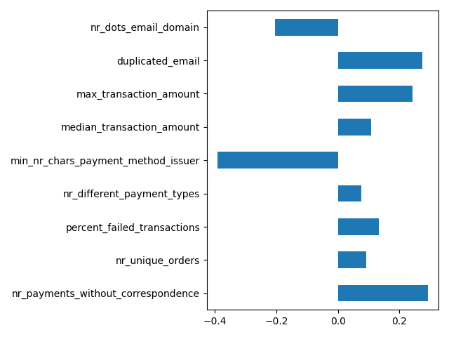

# Ravelin Data Science Test

We provide 2 scripts for this data science challenge:

* `exploratory_analysis.py`: performs an exploratory analysis
of the dataset (that we detail in the next sections), by constructing
some plots and printing some information.

* `fraud_detection.py`: constructs the customer dataframe from the raw
dataset, splits the data into training and test, fits a random forest 
classifier to detect fraudulent customers, and finally evaluates the 
model on the test set.

## Data Exploration

This section describes our data exploration process and findings,
obtained with the `exploratory_analysis.py` script.

The first step was to look at the customers dataset and try to 
understand it. The features that describe each customer are:

*   **fraudulent**: label indicating whether or not the customer is fraudulent;
*   **customer**: contains details of the customer such as contact information,
device, billing address and IP address;
*   **orders**: list of the customer's orders. Contains details such as the order's 
ID, amount, state and shipping address;
*   **payment methods**: list of payment methods used by the customer. Includes payment method ID,
whether or not the registration failed, type of payment, provider and issuer.
*   **transactions**: list of transactions, detailing the transaction ID, order ID that it refers,
payment method ID used, amount transacted and whether or not the transaction failed.

What links the items in these 3 lists are the features:

*  **orderId**, present in order and transaction items;
*  **paymentMethodId**, present in payment methods and transactions.

So, in order to load the json dataset to a dataframe, we flatted all the keys in each list (customer, 
orders, payment methods and transactions) and, for each customer, we merged the information by `orderId`
and `paymentMethodId`.

We observed that for a single order, there can be multiple transactions 
(as transactions may fail, the customer can try again). 
Moreover, we noted that there are cases in which a 
customer has performed payments but has no registered order nor 
transaction associated. 

As a first step, we **eliminated** all **customers** that have **no activity 
information**, i.e. whose `orders`, `paymentMethods` and `transactions`
are empty lists. We understood that these customers do not have 
enough information, and correspond to ~1.62% of the dataset (only 1 
of these customers is fraudulent).

Then, inspired by the observation made above, we created a boolean column called
`is_payment_without_correspondence` that indicates the cases in which transactions don't
have an order nor a payment method associated.

By looking at the `paymentMethodIssuer` column, we observe that some
(fraudulent) customers have issuers that are only a single character.
For that reason, we created the `nr_chars_payment_method_issuer` 
variable that contains the number of characters in the payment method issuer.

Below we plot the class distribution, where we have
* 60 (38.46%) fraudulent customer;
* 96 (61.54%) non-fraudulent customers.

### Customer Dataframe & Feature Engineering

By flattening the data into a dataframe, we have multiple rows per customer.
As the goal of this challenge is to identify fraudulent users,
we must summarize information per user into a single row. Here are
the features we created:

* `nr_payments_without_correspondence`: counts the number of payments
that have no order nor transaction associated.

* `nr_unique_orders`: counts the number of unique orders made by each
customer.

* `percent_failed_transactions`: percentage of the transactions that
failed.

* `nr_different_payment_types`: number of different types of payments 
made by the customer. These include bitcoin, card, apple pay and paypal.

* `min_nr_chars_payment_method_issuer`: minimum number of characters of the
payment method issuers. Our intuition was that issuers with very few characters
typically correspond to fraudulent users.

* `median_transaction_amount`: median value transacted.

* `max_transaction_amount`: maximum value transacted.

* `duplicated_email`: whether or not the customer's email is
also used by other customers. We observed that there was one 
repeated email (johnlowery@gmail.com) in 7 fraudulent users.

* `nr_dots_email_domain`: number of dots in the email 
domain (what comes after the @ symbol).

During the construction of these customer features, we also
addressed the questions:

* Are there duplicated phone numbers? No.
* Is it always true that `transactionAmount` == `orderAmount`? Yes.
* Is there a strong relation between the type of payment method
used and the type of customer (fraudulent or not)? By looking
at the histogram below, we established that the relation was not
strong enough to build a new feature. Instead, we used the number
of different payment method types used by each customer.

* Is there anything in particular in the customer device or IP address
that distinguishes his behavior? By taking a quick scan at these features, 
we did not encounter a particular feature allow us to clearly separate
a fraudulent from a non-fraudulent user.  

In case we have obtained different answers, new features might 
have been created.

### Correlation Matrix

To have an idea whether these engineered features are going to be useful 
in modeling the customer behavior (fraudulent or not), we compute the 
correlation of each feature with the output variable. 

 

Looking at the correlation matrix, we can infer that:

*   the strongest correlation (in magnitude) of the output variable is with the `min_nr_chars_payment_method_issuer`, 
with value of -0.39. So, as the **number of characters in the payment method issuer** decreases, the more likely it 
is for the customer to be fraudulent.

*    the number of **payments that don't have an order nor transaction associated** (`nr_payments_without_correspondence`) 
also positively correlate with the output variable.

*    users with **duplicated email**, i.e. the user email is being used by other users, have also a strong correlation 
with being fraudulent.

*    users that make more **expensive purchases** (`max_transaction_amount`) tend to be fraudulent.

With significantly less correlation to the output variable than the previously
mentioned predictive variables, we have the **percentage of failed transactions** and **median amount transacted**.

To have an intuition about how the top 4 correlated features 
interact with the output variable, we plotted their histograms
separated by class, as depicted below.

## Classification Model

In this section we will describe the model used for customer
classification, as well as the results obtained. For that, we
used the `fraud_detection.py` script.

Now that we have cleaned our dataset and constructed features that
attempt to summarize each user, we start by splitting the data into
train and test using a 80/20 split, maintaining the proportion of fraudulent to non-fraudulent
customers in each split equal to the original dataset. Below you can find the 
histogram of customers per class, per data split.

For modeling the customer profile, we used a Random Forest classifier. 

Since we have such a small dataset, we trained 10 random forest, each 
on a different random split of the dataset. We computed the performance on
the training and testing datasets, and averaged the results, as shown below.

|   Dataset  | Accuracy |  AUC  | Precision | Recall | F1-score |
|:----------:|:--------:|:-----:|:---------:|:------:|:--------:|
|    Train   |   0.995  | 1.000 |   1.000   |  0.990 |  0.995   |
|    Test    |  0.785   | 0.912 |   0.896   |  0.800 |  0.841   |

By looking at the average results, we see that there is an overfit
to the training set, as the model has such good results on the 
training set, but has considerably worst results on the test set.

Our **best model** (in terms of the test set) has the following 
performance metrics:

|   Dataset  | Accuracy |  AUC  | Precision | Recall | F1-score |
|:----------:|:--------:|:-----:|:---------:|:------:|:--------:|
|    Train   |   0.99   | ~1.00 |    1.00   |  0.98  |   0.99   |
|    Test    |   0.97   | ~1.00 |    0.92   |  1.00  |   0.96   |

Below we have the confusion matrix for the training data, where GT stands
for ground-truth label.

|    |           | Predicted |       |
|----|-----------|:---------:|:-----:|
|    |           | Non-fraud | Fraud |
| GT | Non-fraud |     76    |   0   |
|    |   Fraud   |     1     |   47  |

Lastly, we have provide the confusion matrix regarding the test
set, depicted below.

|    |           | Predicted |       |
|----|-----------|:---------:|:-----:|
|    |           | Non-fraud | Fraud |
| GT | Non-fraud |     19    |   1   |
|    |   Fraud   |     0     |   12  |

For this best model, the results seems very good and consistent across 
the train and test splits. The latter indicates the model did not overfit 
to the training set.

### Feature Importance

As features that occur closer to the root of decision trees are
usually more relevants to predict the label of the observations, 
we will use our random forest model to determine which features 
are more important in determining whether or not a customer is 
fraudulent.

Below is a plot of feature importance in our best random forest model.

Comparing to the correlation matrix computed in the data exploration phase,
we see that the variable `min_nr_chars_payment_method_issuer` was consistently
relevant in determining the customer's behavior. We also observe that 
`nr_different_payment_types` was the least correlated variable, as well as 
 the variable with smaller feature importance. 
 
In fact, if we look at the histograms at the end of section 
[Correlation Matrix](#correlation-matrix), we see that for all of these
4 variables, there is a threshold from which (either below or above)
we only have fraudulent users. So it makes sense that these variables
are typically located closer to the root of decision trees.

## Possible Improvements

In this section we refer some possible improvements to this task
if we were given more time to work on it. As we have a small
dataset, our suggestions are all related to feature engineering
 (and not regarding the model), namely

* Explore more the customer IP address feature - is there a type of
pattern in the IP address that can help us identify fraudulent users?

* Explore the relation between the customer's billing address and order's shipping address. 
How many different shipping addresses does a customer have?

* Include the `paymentMethodProvider` as a categorical variable (or use one-hot encoding). Count number
of different payment method provider per customer.